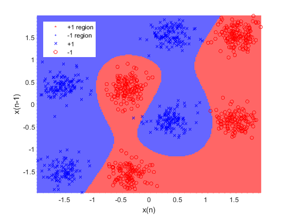

# Лекция 1. Введение

раздел "Математика нейросетей"

\- откуда в нейросетях перемножение матриц?

\- псевдокод MLP forward

\- MLP в виде СФЭ и в формульном виде

\- расписываем chain rule

\- псевдокод MLP backward

\- рассмотрим матрично векторное дифференцирование (таблица производных, градиент для разных случаев, матрица якоби для сигмоды)

\- MLP backward с подставленными производными

\- о гибкости фреймворка (пример с RL, эмбединги)

раздел "Зачем нужно что-то кроме MLP?"

\- рост числа параметров (свойства ммп)

\- parameter sharing in CNN

\- визуализация CNN

\- mlp mixer и gated mlp

раздел “из интересного”

\- оптимизация батчами

-  универсальный аппроксиматор

## Вспоминаем ML

### Логистическая регрессия

Пусть имеется выборка $\{x_i,y_i\}_{i=1}^\ell$, где $x_i\in\R^d$ — признаковое описание $i$-го объекта, $y_i\in\{-1,+1\}$ — метка класса. Мы имеем дело с задачей бинарной классификации. В классическом машинном обучении существует алгоритм линейной классификации: $y(x)=\text{sign}(w^Tx)$, где $w\in\R^d$ — обучаемые веса. Обучение происходит за счет минимизации эмпирического риска $Q$, который представляет собой сумму функций потерь по всем объектам в обучающей выборке: $Q=\sum_{i=1}^\ell\mathcal{L}(x_i,y_i,w)$. Линейный классификатор называют логистической регрессией, если в качестве $\mathcal{L}$ выбрано следующее:
$$
\mathcal{L}(x,y,w)=-\log\sigma(yw^Tx),\quad\sigma(z)={1\over1+\exp(-z)}.
$$
Функционал $Q$ в таком случае называют логлоссом. Задачу оптимизации логлосса решают градиентными методами (например, SGD, LBFGS). Они требуют знание аналитических формул для подсчета градиента. Градиент функции потерь $\mathcal{L}$ можно вычислить с помощью стандартных правил матрично-векторного дифференцирования и правила цепочки:
$$
\begin{align}
{\partial\mathcal{L}\over\partial w}&={\partial yw^Tx\over\partial w}{\partial \sigma(yw^Tx)\over\partial yw^Tx}{\partial (-\log\sigma)\over\partial \sigma}\\
&=yx\cdot\sigma(yw^Tx)(1-\sigma(yw^Tx))\cdot{-1\over\sigma(yw^Tx)}\\
&=-yx(1-\sigma(yw^Tx)).
\end{align}
$$

### Граф вычислений (СФЭ) логистической регрессии

Давайте взглянем на алгоритм логистической регрессии с точки зрения входов, выходов и промежуточных результатов. Введем обозначения:

- $z:=w^Tx$ — логит,
- $a:=\sigma(z)$ — вероятность,
- $\mathcal{L}:=-\log a$ — значение функции потерь.

Справедлива следующая схема:

Вершины в графе обозначают численные значения, ребра — операции. Зеленым цветом обозначены входы алгоритма (признаковое описание), желтым цветом обозначен выход, синим цветом обозначены промежуточные вычисления. 

### Мультиномиальная регрессия

Пусть имеется выборка $\{x_i,y_i\}_{i=1}^\ell$, где $x_i\in\R^d$ — признаковое описание $i$-го объекта, $y_i\in\{1,\ldots,K\}$ — метка класса. Мы имеем дело с задачей многоклассовой классификации. В классическом машинном обучении существует алгоритм линейной классификации: 
$$
y(x)=\text{arg}\max_{1\leqslant k\leqslant K}(w_k^Tx),
$$
где $W\in\R^{K\times d}$ — обучаемые веса. Линейный классификатор называют мультиномиальной регрессией, если в качестве $\mathcal{L}$ выбрано следующее:
$$
\mathcal{L}(x,y,w)=-\log{\exp(w_y^Tx)\over\sum_{k=1}^K\exp(w_k^Tx)}.
$$
Функционал $Q$ в таком случае называют кросс-энтропией. Заметим, что в некотором смысле алгоритм мультиномиальной регрессии состоит из $K$ логистических регрессий.

### Граф вычислений (СФЭ) мультиномиальной регрессии

Введем обозначения:

-  $z_k:=w_k^Tx$ — логит для класса $k$,
- $a_k:=\exp(z_k)$ — активация для класса $k$.

 Справедлива следующая схема:

## Многослойная полносвязная сеть

Заметим, что активации $a_i$ выстраиваются в ряд, подобный тому, в который выстраиваются входы $x_i$. Идея многослойной полносвязной сети (прибизительно) состоит в том, чтобы подать активации $a_i$ на вход другой мультиномиальной регрессии, а для подсчета функции потерь использовать финальные активации. Эту операцию можно повторить $L$ раз и получится $L$ “слоев”.

Схема для $L=2$:

Немного терминологии. На данной схеме:

- $W^1\in\R^{n\times d}$ — обучаемые веса первого слоя,
- $W^2\in\R^{K\times n}$ — обучаемые веса второго слоя,
- $f:\R\to\R$ — некоторое нелинейное преобразование, т.н. функция активации (например, сигмоида),
- $z^1,a^1\in\R^n$ — активации первого слоя (а не логиты и вероятности),
- $z^2,a^2\in\R^K$ — активации второго слоя (но по совпадению логиты и вероятности).

Каждый $z$ еще называют суммматором, или нейроном (по аналогии из биологии, согласно которой нейроны суммируют сигналы от других нейронов, с которыми они связаны). Активации $z^1$ и $z^2$ называют слоями нейронов.

Есть и жаргонные термины. Линейные преобразования $z^1=W^1x$ и $z^2=W^2a_1$ называют линейными слоями (хотя на самом деле это операции, а не ряды чисел, и никакие слои они не могут образовывать). Так же и операцию $f$ часто называют слоем активации (хотя никаких слоев нет).

## Многослойность

Какой смысл в многослойной архитектуре? Если отвечать коротко, то каждый слой преобразует признаки и делает их более абстрактными и высокоуровневыми.

Рассмотрим на примере задачи классификации изображения. Будем подавать каждое (монохромное) изображение размера $H\times W$ в виде вектора $x\in\R^{HW}$, где каждое число означает яркость соответствующего пикселя. Каждый нейрон первого слоя действует как логистическая регрессия, которая “детектирует” наличие ярких точек в некоторых частях изображения. Например, вполне допустимо, что один нейрон будет “детектировать” некоторую прямую линию, как и остальные нейроны в слое. Вся эта информация затем подается во второй слой (например, в виде вероятностей из сигмоиды). И тогда нейроны (=бинарные классификаторы) второго слоя вполне вероятно смогут обучиться видеть целые геометрические фигуры. Все потому что им поступает более высокоуровневая информация нежели сырые пиксели. На вход третьему слою уже пойдет информация о том, какие геометрические фигуры и в каких местах есть на изображении, а на основании этого вполне реально произвести классификацию и понять, что за существо изображено на картинке.

Таким образом, многослойная архитектура позволяет выучивать преобразования признаков, делать их более высокоуровневыми и абстрактными.

Стоит заметить, что важной частью многослойной полносвязной сети являются нелинейные преобразования. Они стоят между линейными преобразованиями. Если бы функций активаций не было и все линейные преобразования шли подряд, то вся нейросеть была бы эквивалентна одной линейной модели. Таким образом, функции активации повышают репрезентативную способность нейросетей, расширяя их до класса нелинейных моделей.

## Гипотеза компактности

Многослойность архитектуры нейросетей связана с вопросом о том, когда применять нейронные сети. Ответ: в тех доменах, где не выполнена так называемая гипотеза компактности. Гипотезой компактности называют свойство данных, в которых семантически похожим объектам соответствуют близкие по метрике векторные представления (признаковые описания). 

Вот пример данных, для которых выполнена гипотеза компактности.

Рассмотрим примеры данных, в которых гипотеза компактности не выполнена.

Во-первых, это изображения. Ниже представлены два изображения буквы омега. С точки зрения смысла, эти изображения являются очень похожими объектами. Однако если мы вытянем эти пиксели в вектора, то косинус между ними будет нулевой, а евклидово расстояние ожидаемо большим.

Во-вторых, это текст на естественном языке. Ниже представлены два предложения с одинаковым смыслом, но с абсолютно разными словами (за исключением стоп-слов). Векторные представления в виде мешка слов имеют нулевой косинус и большое евклидово расстояние

> 1. The cat is sleeping on the couch.
> 2. A feline rests upon the sofa.

В-третьих, это аудио-сигнал. Если одно и то же слово произнесут два человека с разной высотой голоса, то волноформа сильно поменяется, хотя смысл сообщения останется тем же.

Примеров еще очень много. Со всеми ними нейросети справляются за счет того, что каждый слой преобразует сырые признаки и получает все более абстрактные. При этом на последнем слое получается богатое признаковое описание, для которого гипотеза компактности выполнена, поскольку финальный слой — это просто мультиномиальная регрессия.

## Проходы вперед и назад

Нейросети обучают градиентными методами по аналогии с тем, как обучают линейные модели классификации. 
